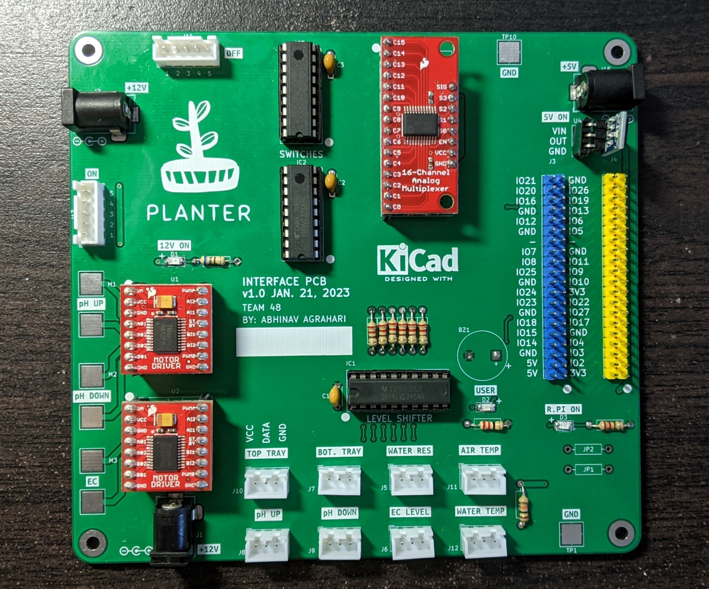
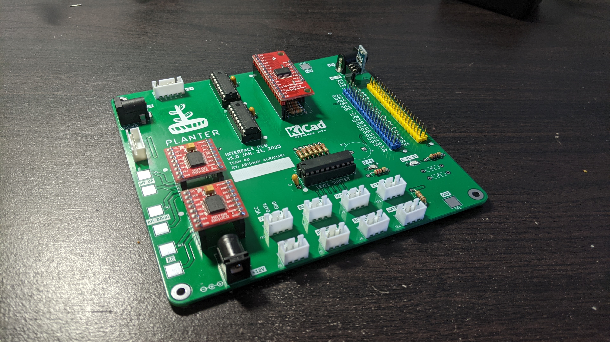
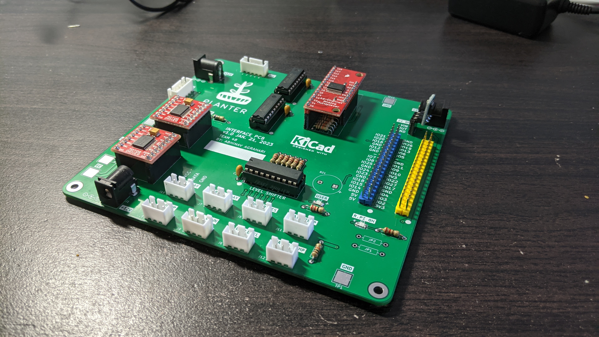
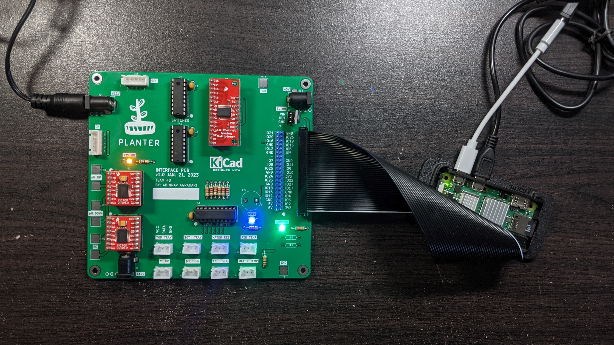
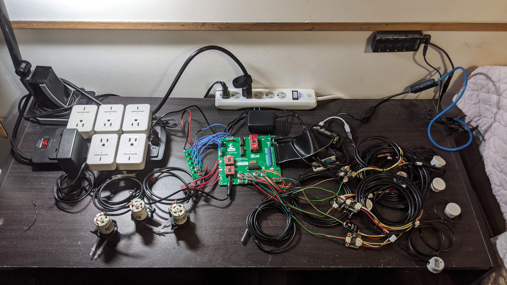
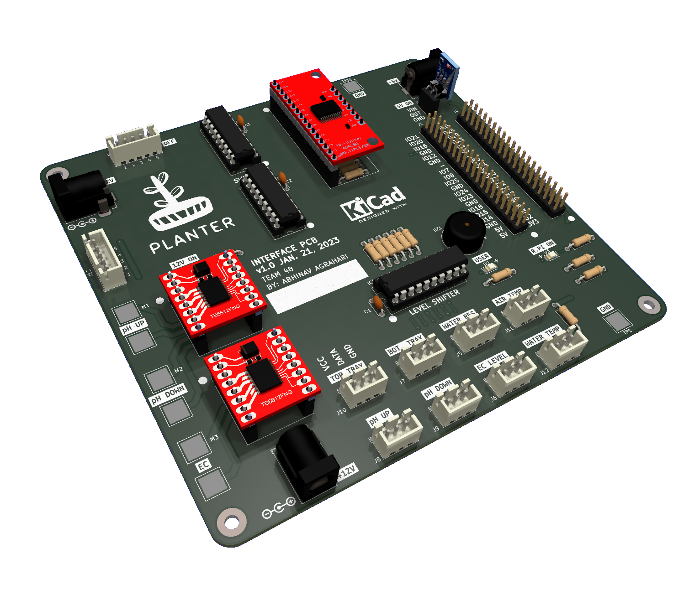
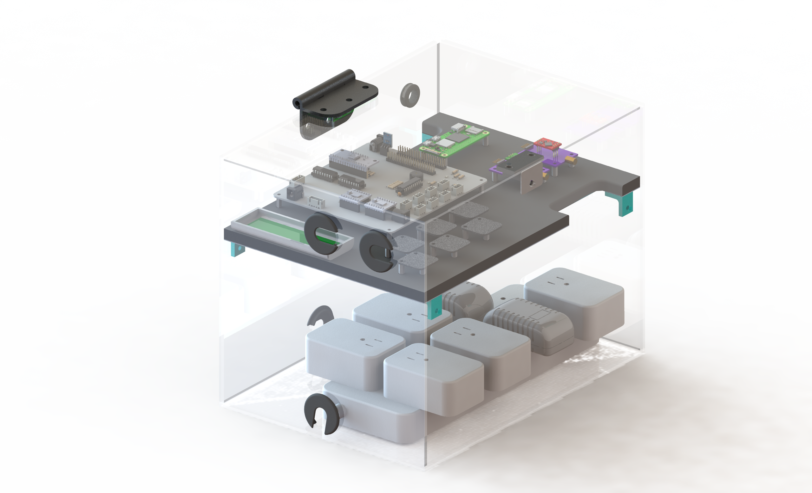

# Planter Interface PCB

Interface PCB for an automated hydroponics system, created using KiCad 6.0. 

This PCB enables control and interfacing a Raspberry with several liquid level sensors, 12V peristaltic pumps, a few temperature sensors, and remote controllable outlets.

This PCB acts as a carrier board for various off-the-shelf breakout boards. It enables noise-free signals, painless testing, and robust interfacing of the liquid level sensors, peristaltic pumps, air & water temperature sensors, and electrical outlets. Standardized connector types are used to guarantee secure connections; connector types are differentiated by their purpose and voltage level, to ensure no mismatch between components and voltage levels occur. The use of breakout boards alleviates the difficulties in procuring discrete Integrated Circuits (ICs) during the ongoing chip shortage. 

## Manufactured board

| Left View | Right View |
| :---: | :---: |
|  |  |

Hooked up to all sensors:

## Renders

## Routing

## Mechanical Team's Enclosure
The PCB is placed in the top shelf of the enclosure designed by the Mechanical Team

## Schematic

## Repo Setup
- Setup KiCad 6.0 using my [kicad-libraries](https://github.com/AbhinavA10/kicad-libraries)
