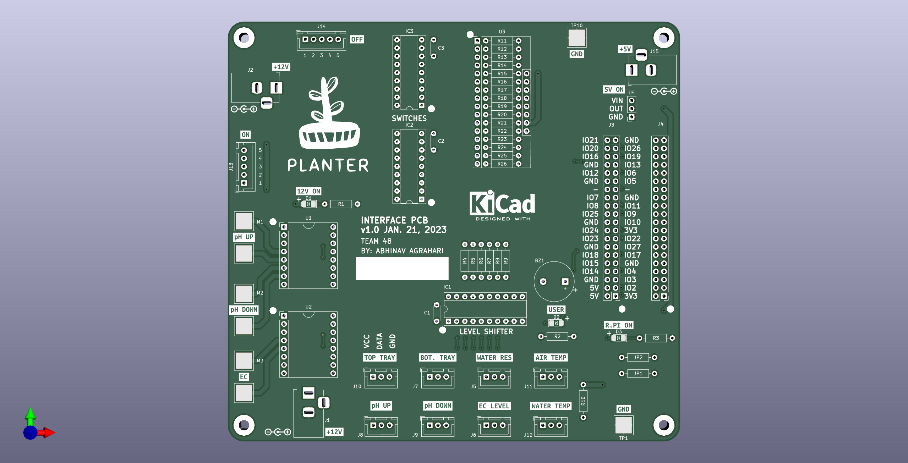
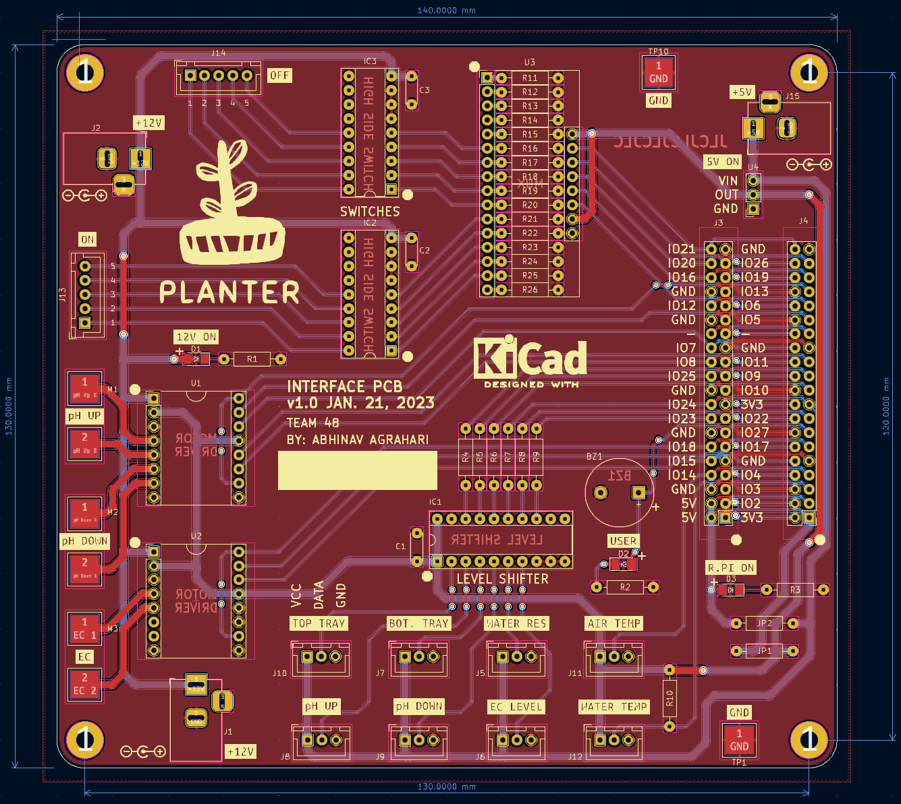
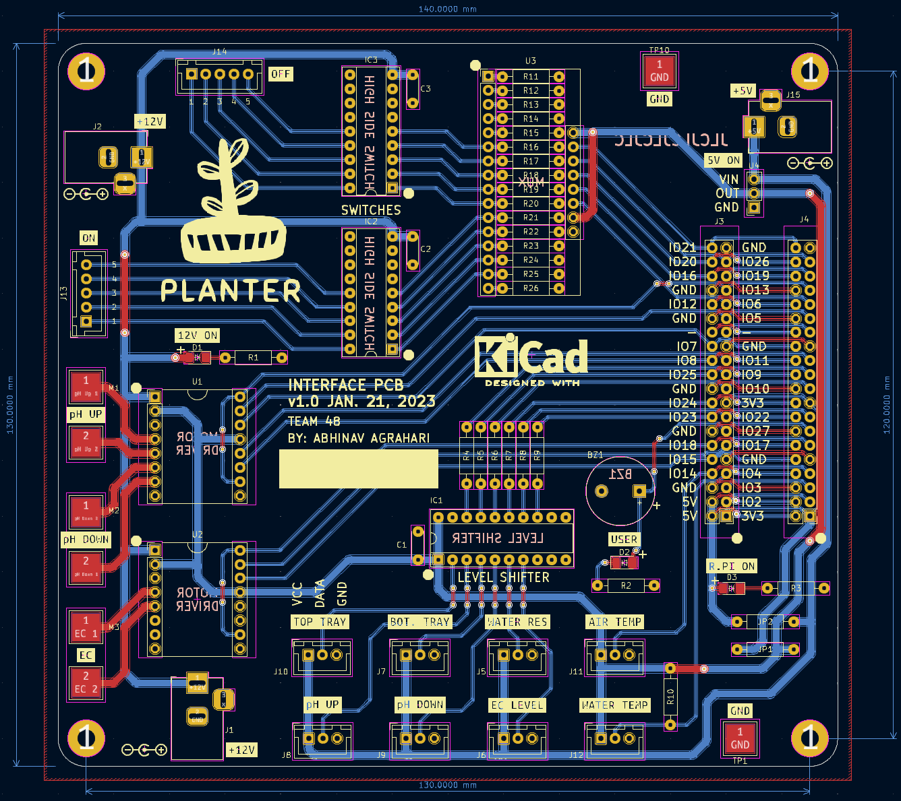
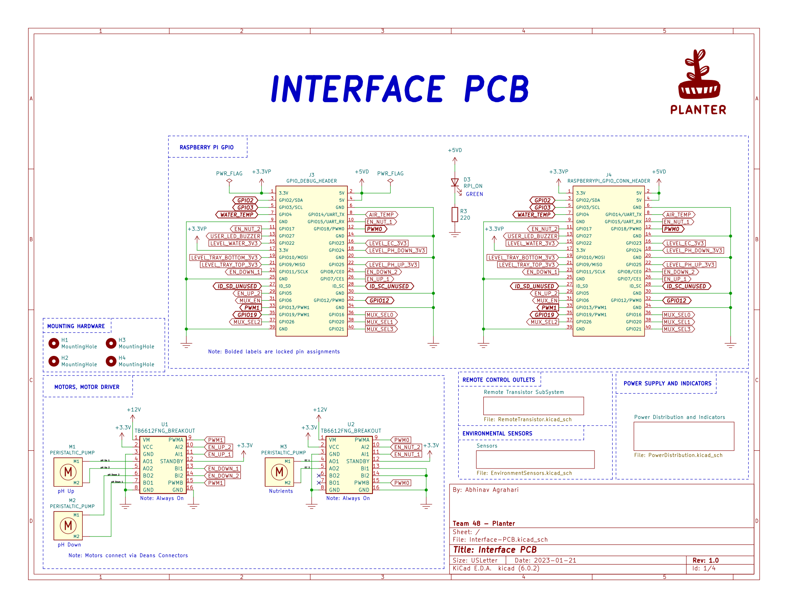
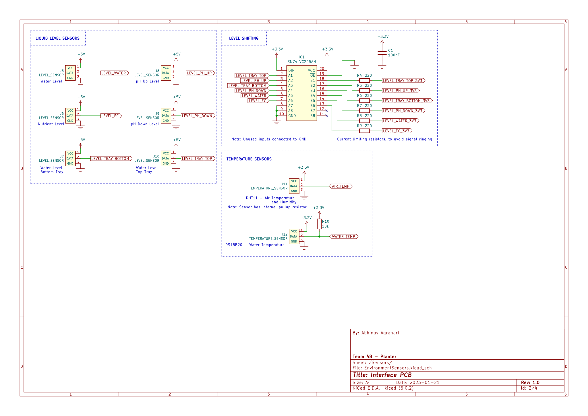
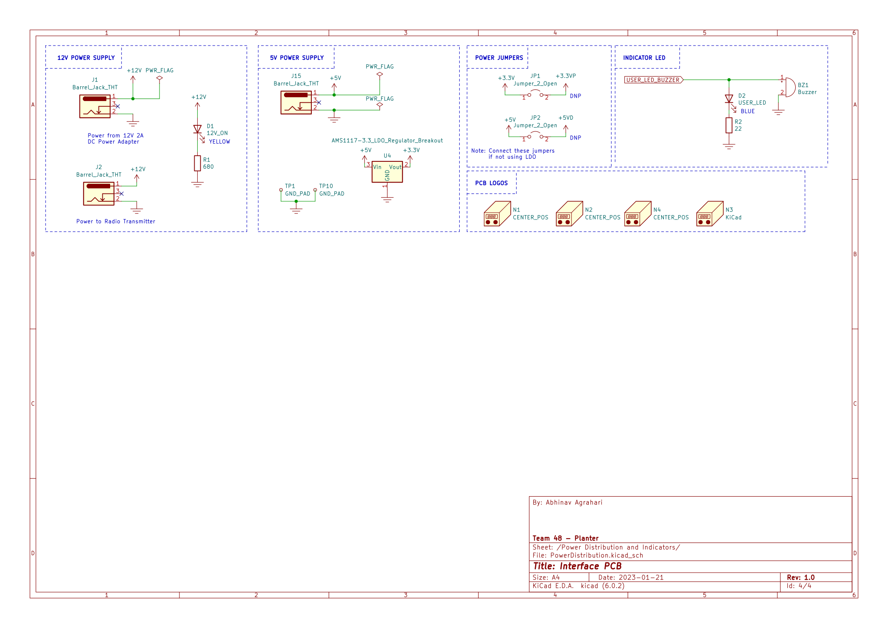
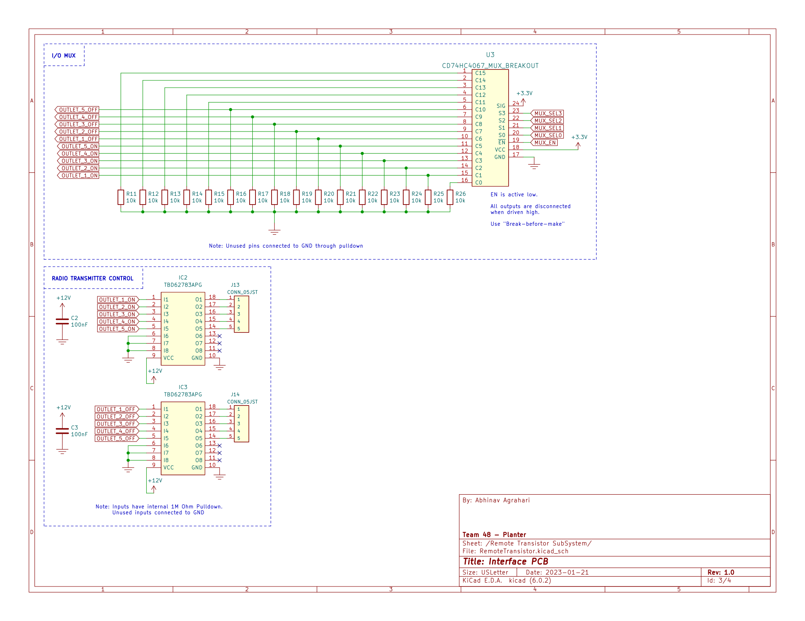

# Planter Interface PCB

Interface PCB for an automated Hydroponics system, made using KiCad 6.0. 

This PCB enables control and interfacing a Raspberry with several liquid level sensors, 12V peristaltic pumps, a few temperature sensors, and remote controllable outlets.

## Renders

## Routing

## Schematic

## Repo Setup
- Setup KiCad 6.0 using my [kicad-libraries](https://github.com/AbhinavA10/kicad-libraries)
